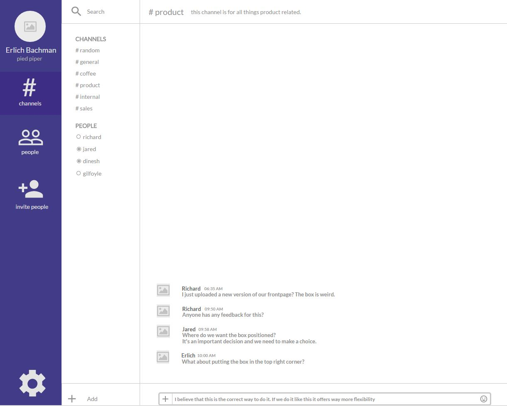

# Senior frontend task

Hi there!

Thank you for participating in the recruitment process for a senior frontend developer at MarketScape. We've made a small task for you.



The image above shows a simple(and poorly designed) chat application. The chat is divided into several channels. The task is simple - to implement it.

The font used is (Lato)[https://fonts.google.com/specimen/Lato]. A view of the website implemented with UXPin can be seen [here](https://collaborate.uxpin.com/b8276ce351be48f3b69a32083c263e8fb958430a#/pages/57076903). You should use it for reference with regards to layout, font sizes and colors - not as a reference on how to code it.

You can use CodePen(create a new account and a new pen) or something similar. When you are done working on the site you should send the link to access it to pp@marketscape.com. Please remember that if you select an alternative to CodePen it should follow the these requirements:

* The site should be hosted (when we click the link it should be usable)
* The code behind the widget is accessible

## Rules 

* You can use any CSS preprocesser if you want to. In fact - we encourage it! You can also use preprocessers for JavaScript.
* We have included some data in the `data.json` file for populating the chat with content. For a description of this data structure see the last section.
* The only available action site is changing chat rooms. When clicking a chat room (#random, #general, and so on) it should change the content in the header and the chat). It should not be possible to add new rooms or make comments.
* Pay attention to code quality, comments, formatting and similar things
* We estimate that the coding for this should take around 3 hours

## Data

The data is given in a JSON structure. It is structured as follows:
```
{
  "channels": {   # Describes the channels to show under the CHANNELS header
     "channel_name": {    # The channel name. Should be shown under CHANNELS and in the top header
         "purpose": "string",  # A description of the purpose of the channel to show in the header
         "messages": [   # A list of messages that belong to the channel
             {"name": "string",    # Name of the person who made the post
              "time": "string",    # Time of the post
              "message: []}        # List of messages
         ]
         "time": "string", # The time where the post was made
      }
  },
  "people": {    # Describes the people to show under the PEOPLE header
    # Same structure as for channels
  }
}
```
The chat rooms have the same layout regardless of being a directly with a person or a whole channel.

## Feedback

If you have any feedback or questions about this challenge feel free to contact us at pp@marketscape.com
